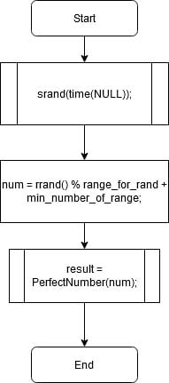
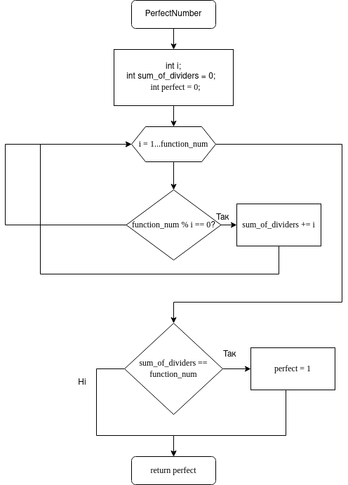
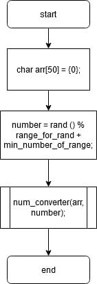
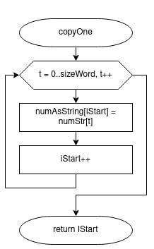
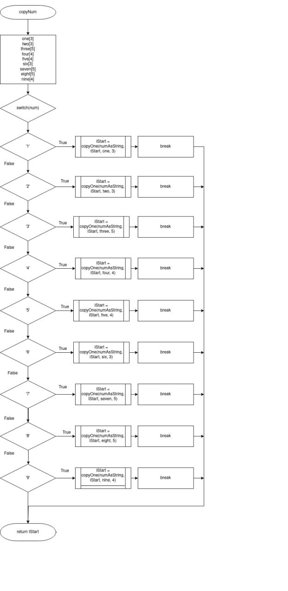
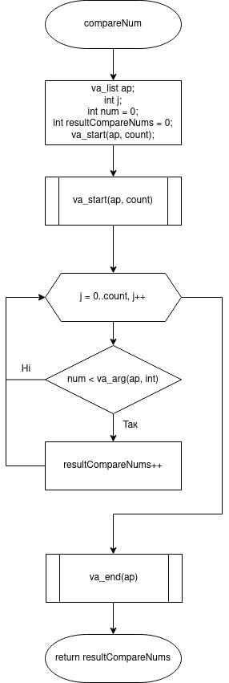

# Лабораторна робота №8. Вступ до блок-схем алгоритмів. №9. Вступ до документації коду (частина 1). №10. Вступ до локументації проекту.

## Вимоги:
* *Розробник*: Гладков Костянтин
* *Загальне завдання*: Реалізувати програму з використанням функцій.
* *Індивідуальне завдання* : Реалізувати функцію, що визначає скільки серед заданої послідовності таких пар, у котрих перше число менше наступного, використовуючи функцію з варіативною кілткістю аргументів.
## Опис роботи
* *Функціональне призначення* :      Виконання перевірки певних умов для задач, може бути використовано
для звірення даних або навіть криптогiовичрафії

* *Опис логічної структури для завдання 4 з лабораторної роботи № 5* :
	Функція main генерує число за допомогою rand пiсля чого викликає функцію для знаходження результату. Схема функції:
	
	
	
	Функція PerfectNumber використовує цикл для знаходження всіх числ, які дадуть залишок 0 після поділу нашого числа на них. Всі ці цифри складаються в sum_of_dividers рис. 2
	
	
	

* *Важливі елементи програми*:

   ```
for (i = 1; i < function_num; i++) {
	if (function_num % i == 0) {
		sum_of_dividers += i; //Getting all the i values which suit us and summing them in the result
	}
}
if (sum_of_dividers == function_num){
	perfect = 1; //true
}
   ```

  * *Опис логічної структури для завдання 3 з лабораторної роботи № 6* :
	Функція main визначається число за допомогoю rand, а також інціалізація результуючого масиву, виклик функції, яка заповнює цей масив, виклик варіативної функції, яка обчислює кількість пар, у яких перше число менше наступного. 
	
	
	
	Функція 'copyOne' переписує число або розряд у результуючий масив. Схема алгоритму функції:
	
	
	
	Функція 'copyNum'оприділяє, яку цифру треба записати у результуючий масив. Схема алгоритму функції:
	
	
	
	Функція 'compareNum' обчислює кількість пар, де перше число менше наступного. Схема алгоритму функції:
	
	
	
# Варіанти використання
* *Для завдання 4 з лабораторної роботи № 5*:
    Дана програма може бути використована для криптографiї та звiрювання
данних.
   
	
* *Для завдання 3 з лабораторної роботи № 6*
    Ця програма може бути використана щодня для спрощення своєї роботи.
Завдяки ній не доведеться вручну переводити число в слова, достатньо скопіювати результат програми.

	
* *Структура програми*:
```	
.
├── doc
│   ├── assets
│   │   ├── lab05_task3_perfect_num.png
│   │   ├── lab05_task3_main.png
│   │   ├── lab06_task3_compareNum.png
│   │   ├── lab06_task3_copyNum.png
│   │   ├── lab06_task3_copyOne.png
│   │   └── lab06_task3_main.png
│   ├── lab08_09_10.docx
│   ├── lab08_09_10.md
│   └── lab08_09_10.pdf
├── Doxyfile
├── lab05_task3
│   ├── README.md
│   └── src
│       └── main.c
├── lab06_task3
│   ├── README.md
│   └── src
│       └── main.c
├── Makefile
└── README.md

```
# Висновки
У даній лабораторній роботі був придбаний досвід роботи з функціями, які
повертають і не повертають результат, також була вивчена можливість роботи з декількома функціями.


