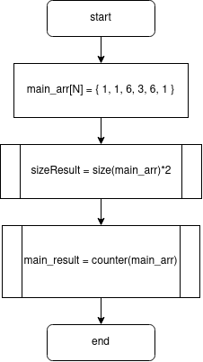
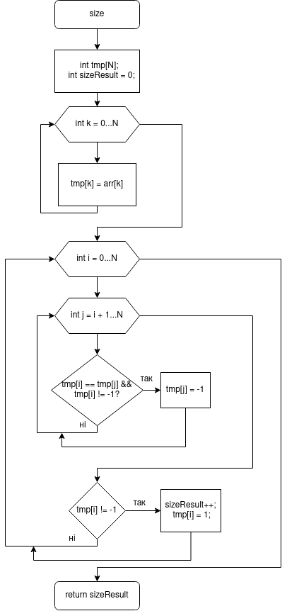
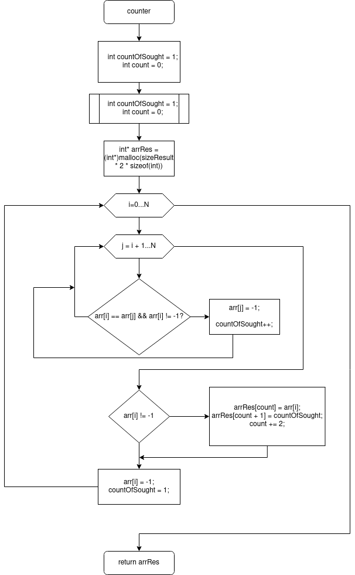

# Лабораторна робота №11. Вступ до показчиків

## Вимоги:
* *Розробник*: Гладков Костянтин
* *Загальне завдання*: Реалізувати програму з використанням показчиків.
* *Індивідуальне завдання* : Дано масив з N цiлих чисел. Визначити, чи є в масивi елементи, що повторюються;якщо такi є, то створити масив, в якому вказати скiльки разiв якi елементи повторюються. Таким чином в результуючому масивi кожен непарный елемент - число, що повторюються; кожен парний елемент - кiлькiсть повторювань.
## Опис програми
* *Функціональне призначення* : Дана програма може бути використана для підрахунок статистики повторень
* *Опис логічної структури* :
	Функція main має в собі масив з елементами, а також викликає функції. Схема алгоритму функції:
	
	
		
	Функція 'fillArrOne' заповнює заданий масив псевдовипадковими числами. Схема алгоритму функції:
	
	
		
	Функція Counter використовується для створення масиву, в якому будуть записані всі потрібні нам значення, а до цих значень приписано кількість їх повторень. Схема алгоритму функції:
		
	

* *Структура програми* 

```
.
├── Doxyfile
├── Makefile
├── README.md
├── doc
│   ├── lab11_Gladkov.docx
│   ├── lab11_Gladkov.md
│   ├── lab11_Gladkov.pdf
│   └── assets
│       ├── doxygen.png
│       ├── lab11_counter.png
│       ├── lab11_main.png
│       └── lab11_size.png
├── task1
│   ├── README.md
│   └── src
│       ├── lib.c
│       ├── lib.h
│       └── main.c
├── task2
│   ├── README.md
│   └── src
│       ├── lib.c
│       ├── lib.h
│       └── main.c
├── task3
│   ├── README.md
│   └── src
│       ├── lib.c
│       ├── lib.h
│       └── main.c
└── task4
    ├── README.md
    └── src
        ├── lib.c
        ├── lib.h
        └── main.c

```
	
	
* *Doxygen-документація*:


## Варіанти використання

Дана програма має широке застосування, вона може бути використана для захисту від DDOS атак, а так само для інших потреб пов'язаних з подветвержденіем даних, або ж просто для получання статистики повторень даних

	
## Висновки

У даній лабораторній роботі було отримано досвід роботи з показчиками, також були покращені знання використання циклів
	

