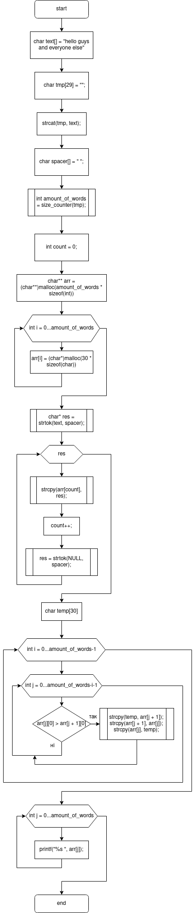
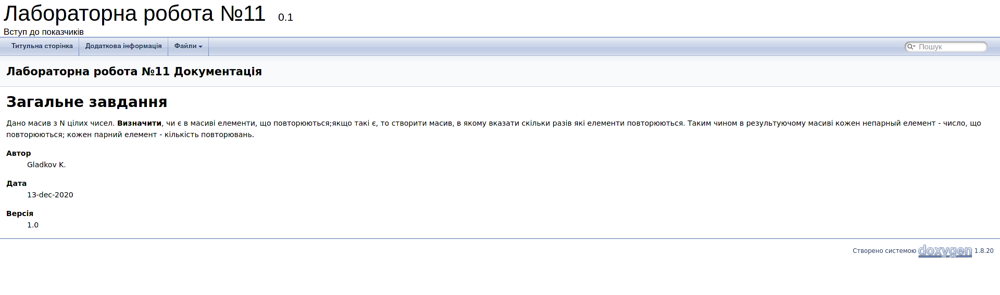

# Лабораторна робота №13. Строки

## Вимоги:
* *Розробник*: Гладков Костянтин
* *Індивідуальне завдання* : Визначити скiльки у текстi слiв (без використання iтерацii по кожному символу у циклу). Видати всi слова за абеткою.
## Опис програми
* *Функціональне призначення* : Дана програма може бути використана для сортування слів, а також для за рахунками їх кількості.
* *Опис логічної структури* :
	Функція main має в собі масив з текстів, виклик функції, а також найголовніші перетворення за допомогою яких і обчислюється все потрібне Схема алгоритму функції:
	
	
		
	Функція size_counter використовує цикл для за рахунками наших прогалин, що і буде змінної count Схема алгоритму функції:
	
	
		

* *Структура програми* 

```
.
├── Doxyfile
├── Makefile
├── README.md
├── doc
│   ├── lab13_Gladkov.docx
│   ├── lab13_Gladkov.md
│   ├── lab13_Gladkov.pdf
│   └── assets
│       ├── lab13_doxy.png
│       ├── lab13_main.png
│       └── lab13_size_counter.png
├── task01
│   ├── README.md
│   └── src
│       ├── lib.c
│       ├── lib.h
│       └── main.c
├── task02
│   ├── README.md
│   └── src
│       ├── lib.c
│       ├── lib.h
│       └── main.c
├── task03
│   ├── README.md
│   └── src
│       ├── lib.c
│       ├── lib.h
│       └── main.c
└── task04
    ├── README.md
    └── src
        ├── lib.c
        ├── lib.h
        └── main.c

```
	
	
* *Doxygen-документація*:




## Варіанти використання

Дана програма має широкий спектр застосування. В основному вона може використовуватися для спрощення справ, пов'язаних з сортуванням даних, бо з нею не доведеться вивчити алфавіт з 0

	
## Висновки

У даній лабораторній роботі були отримані знання роботи з строками в даній мові програмування, також повторений досвід роботи з циклами і поліпшені знання щодо документації коду
	

